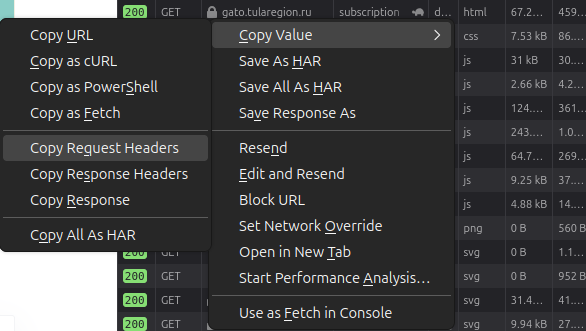

# ASViewer Downloader

ASViewer Downloader is a Python-based tool designed to facilitate the downloading of data from the ASViewer platform. This utility allows users to automate the retrieval of information, streamlining workflows that require data from ASViewer.

## Features

- **Automated Data Retrieval**: Seamlessly download data from ASViewer without manual intervention.
- **Customizable Configuration**: Utilize the `configuration.yaml` file to set up personalized parameters and settings.
- **Flexible Headers Management**: Adjust HTTP headers through the `headers.yaml` file to accommodate different access requirements.

## Requirements

Before installing ASViewer Downloader, ensure that you have the following:

- **Python 3.x**: The tool is compatible with Python version 3 and above.
- **Required Libraries**: All necessary Python libraries are listed in the `requirements.txt` file.

## Installation

To set up ASViewer Downloader on your local machine:

1. **Clone the Repository**:

   ```bash
   git clone https://github.com/mcorvax/asviewer_downloader.git
   ```

2. **Navigate to the Project Directory**:

   ```bash
   cd asviewer_downloader
   ```

3. **Create a Virtual Environment** (optional but recommended):

   ```bash
   python3 -m venv venv
   source venv/bin/activate  # On Windows, use 'venv\Scripts\activate'
   ```

4. **Install Required Dependencies**:

   ```bash
   pip install -r requirements.txt
   ```

## Configuration

ASViewer Downloader uses YAML files for configuration:

- **configuration.yaml**: Define your specific settings and parameters for data retrieval.
- **headers.yaml**: Set up the necessary HTTP headers for accessing ASViewer.

Ensure these files are correctly configured before running the tool.
The easiest way to configure **headers.yaml** is to use `Copy Request Headers` in Firefox or Chrome DevTools:

  

Then, add a colon `:` after `GET` on the first line to create a valid YAML file.


## Usage


```bash
python asdeview.py -h
usage: asdeview.py [-h] [--url URL] [--output OUTPUT] [--start START] [--end END] [--username USERNAME]
                   [--password PASSWORD] [--allowed-spend-money {no,yes}]

I want it all! -- image downloader

options:
  -h, --help            show this help message and exit
  --url URL, -u URL     URL to download images from
  --output OUTPUT, -o OUTPUT
                        Directory to save downloaded images
  --start START, -s START
                        Start downloading from this image number
  --end END, -e END     Stop downloading at this image number
  --username USERNAME, -n USERNAME
                        username for authentication
  --password PASSWORD, -p PASSWORD
                        password for authentication
  --allowed-spend-money {no,yes}
                        'yes' to allow activation of a purchased subscription. ⚠️ Attention: if you run the script
                        simultaneously in multiple instances, use this option in only one of them.

```

The script will run using the settings from the YAML files and any command-line arguments provided.

## Contributing

Contributions are welcome! If you'd like to contribute to ASViewer Downloader, please follow these steps:

1. **Fork the Repository**: Click on the 'Fork' button at the top right of the repository page.
2. **Create a New Branch**: 

   ```bash
   git checkout -b feature/YourFeatureName
   ```

3. **Make Your Changes**: Implement your feature or fix.
4. **Commit Your Changes**: 

   ```bash
   git commit -m 'Add some feature'
   ```

5. **Push to the Branch**: 

   ```bash
   git push origin feature/YourFeatureName
   ```

6. **Create a Pull Request**: Submit your changes for review.

## License

This project is licensed under the [MIT License](LICENSE).

## Acknowledgments

Special thanks to all contributors and the open-source community for their support.
